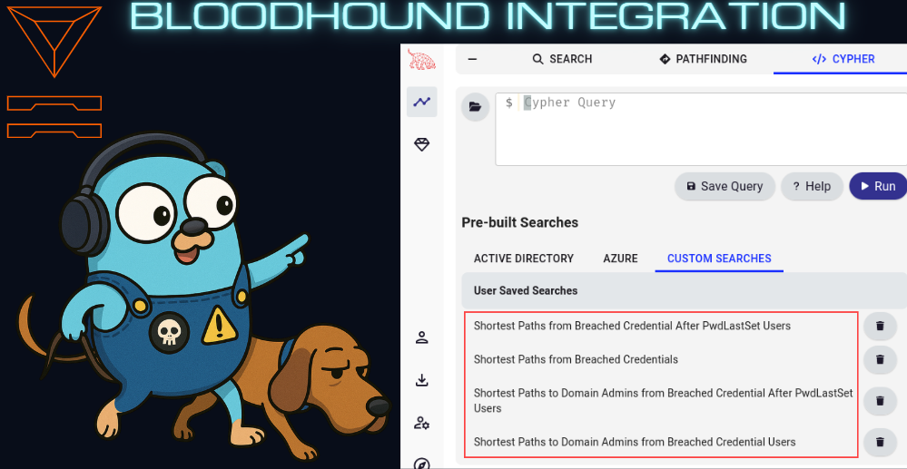

# gophlare

[](https://goreportcard.com/report/github.com/mr-pmillz/gophlare)


[](https://twitter.com/intent/tweet?text=Wow:&url=https%3A%2F%2Fgithub.com%2Fmr-pmillz%2Fgophlare)
[](https://github.com/mr-pmillz/gophlare/actions/workflows/ci.yml)

<p align="center">
  <a href="#about">About</a> •
  <a href="#installation">Installation</a> •
  <a href="#usage">Usage</a> •
  <a href="#supported-api-endpoints">Supported API Endpoints</a> •
  <a href="#flare-api-usage-metrics">Usage Metrics</a> •
  <a href="#configuration">Configuration</a> •
  <a href="#todo">ToDo</a>
</p>

## About

Gophlare is an SDK and CLI-wrapper for the flare.io API. It can be imported and used in other go projects.
Every API endpoint is not fully supported yet.

Gophlare also has several convenience features baked in such as:
1. XLSX and CSV file generation.
2. Stealer logs downloader for zip files or specific files.
3. Stealer logs cookies parser that can sort cookies by expiration date and CookieBro export to JSON support.
4. Getting credentials by domain name.
5. Hash identification for `hash` results that can differentiate between passwords, password hashes, and encrypted values.
6. API usage and quota metrics via `--metrics`, showing how many calls each domain cost and how much of your monthly Global Search quota remains.

## Installation

```shell
go install -v github.com/mr-pmillz/gophlare@latest
```

## Supported API Endpoints

Gophlare currently supports the following API endpoints:

* /firework/v2/activities/{UID}
* /firework/v2/activities/{UID}/download
* /firework/v2/activities/{UID}/download_file
* [/firework/v4/events/global/_search](https://api.docs.flare.io/api-reference/v4/endpoints/global-search)
* [/astp/v2/credentials/_search](https://api.docs.flare.io/api-reference/astp/endpoints/post-credentials-search)
* [/astp/v2/cookies/_search](https://api.docs.flare.io/api-reference/astp/endpoints/post-cookies-search)
* /leaksdb/identities/by_accounts

Of these, only [/firework/v4/events/global/_search](https://api.docs.flare.io/api-reference/v4/endpoints/global-search) draws on your monthly [Global Search quota](https://api.docs.flare.io/concepts/rate-limits-and-quotas). See [Flare API Usage Metrics](#flare-api-usage-metrics).

## Usage

```shell
search the flare api for credentials, emails, and stealer logs

Example Commands:
        gophlare search --config config.yaml --search-credentials-by-domain
        gophlare search --config config.yaml --search-stealer-logs-by-host-domain
        gophlare search --config config.yaml --search-stealer-logs-by-wildcard-host --keep-zip-files --max-zip-download-limit 0
        gophlare search --config config.yaml --search-stealer-logs-by-domain --keep-zip-files --max-zip-download-limit 0
        gophlare search --config config.yaml --search-stealer-logs-by-domain --query 'metadata.source:stealer_logs* AND features.FOO:BAR'
        gophlare search --config config.yaml --search-emails-in-bulk -e emails.txt -o output-directory

Usage:
  gophlare search [flags]

Flags:
  -c, --company string                         company name that your testing
  -d, --domains string                         domains string, can be a file file containing domainss ex. domains.txt, or comma-separated list of strings
  -e, --emails string                          emails to check in bulk. Can be a comma separated slice or a file containing emails. ex. emails.txt
      --events-filter-types string             flare global events filter types. Available values: illicit_networks,open_web,leak,domain,listing,forum_content,blog_content,blog_post,profile,chat_message,ransomleak,infected_devices,financial_data,bot,stealer_log,paste,social_media,source_code,source_code_files,stack_exchange,google,service,buckets,bucket,bucket_object. can be a string, or comma-separated list of strings (default "illicit_networks,open_web,leak,domain,listing,forum_content,blog_content,blog_post,profile,chat_message,ransomleak,infected_devices,financial_data,bot,stealer_log,paste,social_media,source_code,source_code_files,stack_exchange,google,service,buckets,bucket,bucket_object")
      --files-to-download string               comma separated list of files to match on and download if they exist from the query
  -f, --from string                            from date used for a filter for stealer log searches. ex. 2021-01-01
      --global-search-page-size int            events per global search request (the API size param, max 10). larger pages reduce request count but may be slower; quota savings are not guaranteed (default 5)
  -h, --help                                   help for search
      --keep-zip-files                         keep all the matching downloaded zip files from the stealer logs
  -m, --max-zip-download-limit int             maximum number of zip files to download from the stealer logs. Set to 0 to download all zip files. (default 50)
      --metrics                                print a Flare API usage and quota report at the end of the run, and write flare-api-metrics.json to the output dir
      --monthly-quota int                      your Flare monthly Global Search quota, used as the denominator in the --metrics report. Flare sets this per license, so verify it on your tenants page (default 10000)
      --out-of-scope string                    out of scope domains, IPs, or CIDRs
  -o, --output string                          report output dir
  -q, --query string                           query to use for searching stealer logs.
      --search-credentials-by-domain           search for credentials by domain
      --search-emails-in-bulk                  search list of emails for credentials.
      --search-stealer-logs-by-domain          search the stealer logs by *@email domain(s), download and parse all the matching zip files for passwords and live cookies
      --search-stealer-logs-by-host-domain     search the stealer logs by host domain(s), download and parse all the matching zip files for passwords and live cookies
      --search-stealer-logs-by-wildcard-host   search the stealer logs by host wildcard domain(s), (*.example.com) download and parse all the matching zip files for passwords and live cookies
  -s, --severity string                        the stealer log severities to filter on. can be a string, a file, or comma-separated list of strings (default "medium,high,critical")
      --timeout int                            timeout duration for API requests in seconds (default 900)
      --to string                              to date used for a filter for stealer log searches. ex. 2025-01-01. Defaults to today. (default "2025-08-01")
      --user-agent string                      custom user-agent to use for requests
  -u, --user-id-format string                  if you know the user ID format ex. a12345 , include this to enhance matching in-scope results. can be a string, a file, or comma-separated list of strings
  -v, --verbose                                enable verbose output

Global Flags:
      --config string   config file default location for viper to look is ~/.config/gophlare/config.yaml
```

### Configuration

The `USER_ID_FORMAT` option is a powerful feature to match account ID naming formats related to your target. For example, let's say your target uses account IDs with the format, `?l?d?d?d?d?d` , which would be one uppercase or lowercase letter followed by 5 digits, you could set the `USER_ID_FORMAT` in the config.yaml file like so:

```yaml
USER_ID_FORMAT: |-
  a12345
```

The preceding config will match any username with the regex pattern, `^[A-Za-z]\d{5}$` , sparing you the trouble of having to define the exact regex pattern. The function that does this is called, `IsUserIDFormatMatch` and can be found in the `utils` package in `string.go`. If desired, this feature could be extended to also except raw regex patterns also, but for ease of use, regex patterns are dynamically generated based on the USER_ID_FORMAT options provided. 

### Search Stealer Logs for Creds and Live Cookies

If you want to download and parse all matching stealer logs, set the `--max-zip-download-limit` to 0. Default is 50.
By default, this will search the stealer logs going back 2 years but you can adjust the date range using the `--from` and `--to` flags

```shell
gophlare search --config config/config.yaml --search-stealer-logs-by-domain --keep-zip-files --max-zip-download-limit 0 --from 2023-01-01 --to 2025-02-19
```

### Search list of emails for leaked creds

```shell
./gophlare search --config config/config.yaml --search-emails-in-bulk -e emails.txt
```

### Search credentials api by domain for passwords

cli flags should override options set in config.yaml. For example, the following command will output results to the current directory via the `-o` option

```shell
./gophlare search --config config/config.yaml --search-credentials-by-domain -o .
```

### Flare API Usage Metrics

Flare bills Global Search against a monthly quota (10,000 searches on a typical
license). Because gophlare paginates with a cursor, a single domain with a few
thousand stealer-log events can issue hundreds of requests, so it is easy to
spend a large share of a month's quota without noticing.

Pass `--metrics` to get a usage report at the end of any run, plus a
machine-readable `flare-api-metrics.json` in the output dir:

```shell
./gophlare search --config config/config.yaml --search-stealer-logs-by-domain --metrics -o .
```

```text
 FLARE API USAGE — v1.5.0 · 4m12s

 GLOBAL SEARCH QUOTA
   Monthly quota .................   10,000  (--monthly-quota, operator-supplied)
   Observed quota decrease ......       87  via X-Flare-Global-Searches-Remaining
   Remaining .....................    8,913  10.9% of monthly quota used
   Quota-bearing calls counted ...       92  5 above observed — see note

 BY ENDPOINT
   ENDPOINT                            BILLS  CALLS  2xx  429  5xx  RETRIES  AVG
   /astp/v2/credentials/_search        no     34     34   0    0    0        8.1s
   /firework/v2/activities/{uid}       no     35     35   0    0    0        310ms
   /firework/v4/events/global/_search  yes    92     90   1    1    1        1.9s
   /leaksdb/identities/by_accounts     ?      3      3    0    0    0        4s
   TOTAL                                      165    163  1    1    1

 BY ENTITY
   ENTITY           ENDPOINT                            CALLS  QUOTA
   example.com      /astp/v2/credentials/_search        34     —
                    /firework/v2/activities/{uid}       35     —
                    /firework/v4/events/global/_search  61     61
   sub.example.com  /firework/v4/events/global/_search  31     31
   TOTAL                                                165    92

 note: counted (92) exceeds observed (87) — Flare does not bill repeat searches
       within 10 minutes, and 429/5xx retry billing is undocumented.
       The observed interval excludes the first request and can include other clients.
```

**Which endpoints bill?** Only Global Search draws on the monthly quota. Per
Flare's docs the ASTP credentials search "does not count towards your search
quota", and the same holds for the ASTP cookies search; activity retrieval and
the stealer-log downloads are on the basic rate-limit tier, not the search
quota. Billing for `/leaksdb/identities/by_accounts` is **not documented**, so
it is reported as `?` and excluded from quota totals rather than guessed at.

**Observed vs. counted.** `Observed quota decrease` is the difference between
the first and last `X-Flare-Global-Searches-Remaining` headers. These describe
organization-wide state after requests: the difference excludes the first
request and any usage before the first header, and can include other clients.
It is not a measurement of this run's total spend. A single observation or any
increase in remaining quota produces `n/a` (an increase can mean a quota reset,
allocation change, or responses arriving out of order). The JSON field
`observed_consumed` carries this interval decrease and is omitted when unknown;
`quota_observations` and `quota_increased` explain its availability.

The local counters (`quota_units` and `counted_quota_calls`) count attempts on
quota-bearing endpoints as an upper bound, including failures and retries.
They do not measure billed units. Flare documents quota by search and result
batch (up to 100 results per unit), with a grace window for repeated searches.
See [Flare's quota documentation](https://docs.flare.io/global-search-quota) and
[API quota headers](https://api.docs.flare.io/concepts/rate-limits-and-quotas).

**Page size.** `--global-search-page-size` accepts **1–10**, defaulting to **5**.
Larger pages reduce HTTP requests, but can take longer and do not guarantee
quota savings. `--monthly-quota` must be positive. Both settings and `METRICS`
can also be supplied in config, using `GLOBAL_SEARCH_PAGE_SIZE` and
`MONTHLY_QUOTA`; explicit CLI flags take precedence.

Metrics are always collected; `--metrics` controls report emission. Each CLI
invocation owns a recorder. Library callers of the search helpers can use
`Options.MetricsRecorder` or the shared `metrics.Default()` recorder. Direct
`phlare.NewFlareClient` callers opt in with `phlare.WithMetricsRecorder(recorder)`.
A report is written on normal completion and reported search failures, using
the resolved output directory. Paginated searches stop after five consecutive
retries for a page, allowing failures to return and the report to be written.

## gophlare as a library

```go
package main

import (
	"github.com/mr-pmillz/gophlare/cmd/search"
	"github.com/mr-pmillz/gophlare/config"
	"github.com/mr-pmillz/gophlare/phlare"
)

// getDateXYearsAgo returns the `yearsAgo` int as a string in the format:  time.RFC3339
func getDateXYearsAgo(yearsAgo int) string {
	return time.Now().AddDate(-yearsAgo, 0, 0).Format(time.RFC3339)
}

func main() {
	company := "CHANGETHIS" // CHANGE-THIS
	output := "/tmp/example" // CHANGE-THIS
	domains := []string{"example.com"} // CHANGE-THIS
	emails := []string{"test1@example.com", "test2@example.com"} // CHANGE-THIS
	phlareOptions := &phlare.Options{
		Company:    company,
		Output:     output,
		From:       getDateXYearsAgo(1),
		Timeout:    600,
		Severity:          []string{"medium", "high", "critical"},
		EventsFilterTypes: []string{"illicit_networks", "open_web", "leak", "domain", "listing", "forum_content", "blog_content", "blog_post", "profile", "chat_message", "ransomleak", "infected_devices", "financial_data", "bot", "stealer_log", "paste", "social_media", "source_code", "source_code_files", "stack_exchange", "google", "service", "buckets", "bucket", "bucket_object"},
		Emails: emails,
	}
	apiKeys := config.NewGoPhlareConfig("CHANGETHIS", 123456) // CHANGE-THIS
	phlareOptions.APIKeys = apiKeys

	flareCreds, err := search.FlareLeaksDatabaseSearchByDomain(phlareOptions, domains)
	if err != nil {
		panic(err)
	}
	// do something with flareCreds...
	_ = flareCreds

	phlareOptions.MaxZipFilesToDownload = 100
	phlareOptions.UserIDFormat = []string{"a12345", "a123456", "aa12345", "aa123456"}
	scope, err := phlare.NewScope(phlareOptions)
	if err != nil {
		panic(err)
	}

	if err = search.DownloadAllStealerLogPasswordFiles(phlareOptions, scope); err != nil {
		panic(err)
	}

	if err = search.SearchEmailsInBulk(phlareOptions, scope.Emails); err != nil {
		panic(err)
    }
}
```

## Bloodhound Data Correlation

This feature only supports Bloodhound-CE (Community Edition)
Correlate flare breach data with Bloodhound data. Useful for mapping UserID's from AD to breach data.
Four custom cypher queries will be created when using the --update-bloodhound option



### Quick-Start

Use https://github.com/Tanguy-Boisset/bloodhound-automation 

### Bloodhound Usage

```shell
correlate breach data with bloodhound data and optionally update bloodhound neo4j database with breach data and create custom cypher queries for further analysis in bloodhound

Example Commands:
        gophlare bloodhound --config config.yaml
        gophlare bloodhound --config config.yaml -f flare-leaks.json -o some_dir --update-bloodhound

Usage:
  gophlare bloodhound [flags]

Flags:
      --bloodhound-password string               Bloodhound password
      --bloodhound-server-url string             Bloodhound server base URL, ex: http://127.0.0.1:8001
      --bloodhound-user string                   Bloodhound user
  -b, --bloodhound-users-json-file string        Bloodhound JSON file
  -c, --configfileset                            Config file set
  -f, --flare-creds-by-domain-json-file string   Flare credentials by domain JSON file
  -h, --help                                     help for bloodhound
      --neo4j-host string                        Neo4j host
      --neo4j-password string                    Neo4j password
      --neo4j-port string                        Neo4j port
      --neo4j-user string                        Neo4j user
  -o, --output-dir string                        Output directory
      --update-bloodhound                        update bloodhound neo4j database with breach data
  -v, --verbose                                  Verbose output

Global Flags:
      --config string   config file default location for viper to look is ~/.config/gophlare/config.yaml
```

## ToDo

- [ ] Implement remaining API endpoints
- [X] Integrate bloodhound for breach data correlation. (Useful for UserID correlation and shortest paths from breach credentials finding)
- [X] Enhance cookies search
- [X] Export cookies to separate cookie bro output JSON files per stealer log ID
- [X] Add Dockerfile and push to ghcr.io container registry
- [X] Add example library usage to README.md

## Contributing and releases

Feature and fix PRs target `develop`. Stable releases use `release/vX.Y.Z` or
`hotfix/vX.Y.Z` PRs into `main`. See [CONTRIBUTING.md](CONTRIBUTING.md) for checks,
release steps, and GitHub App/ruleset setup.
